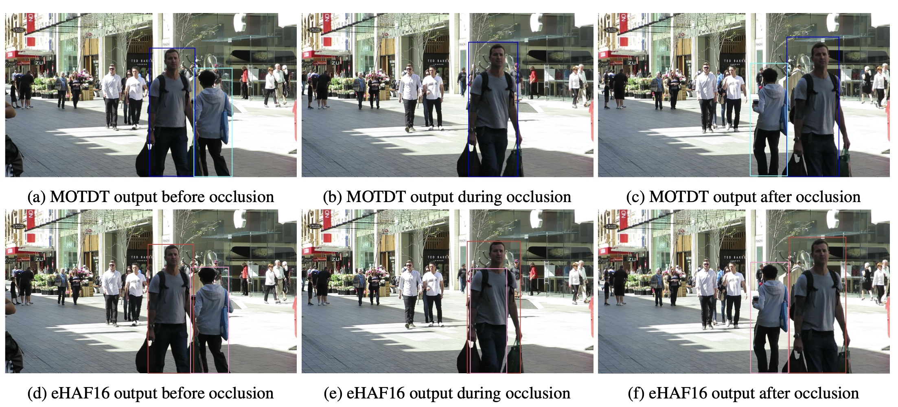
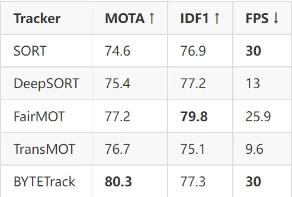

<h1>Deep learning based MOT methods</h1>

### <a href="https://arxiv.org/pdf/1907.12740">Survey 1</a>

### <a href="https://www.mdpi.com/2076-3417/12/21/10741">Survey 2 (Driving)</a>

### <a href="https://medium.com/augmented-startups/top-5-object-tracking-methods-92f1643f8435">An online article</a>

## Dataset from <a href="https://link.springer.com/article/10.1007/s11207-024-02362-3">Chinese</a> paper

## What's next?
Implement the simplest on the data
