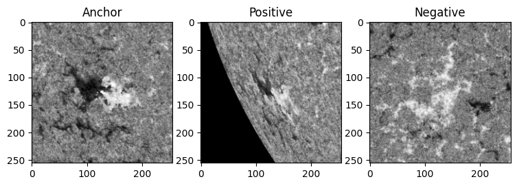
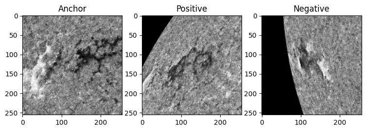
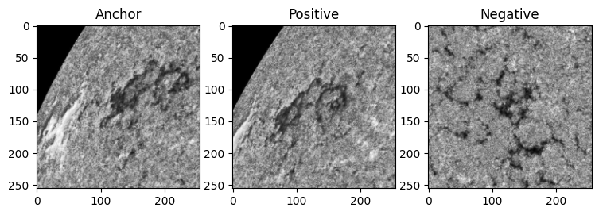
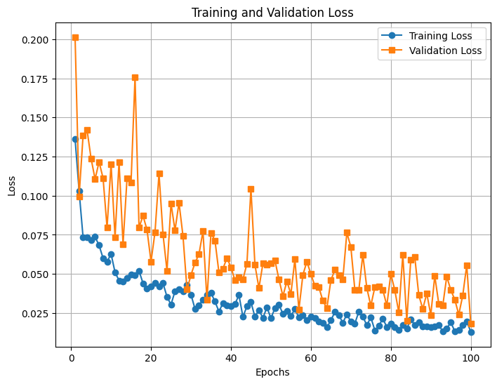
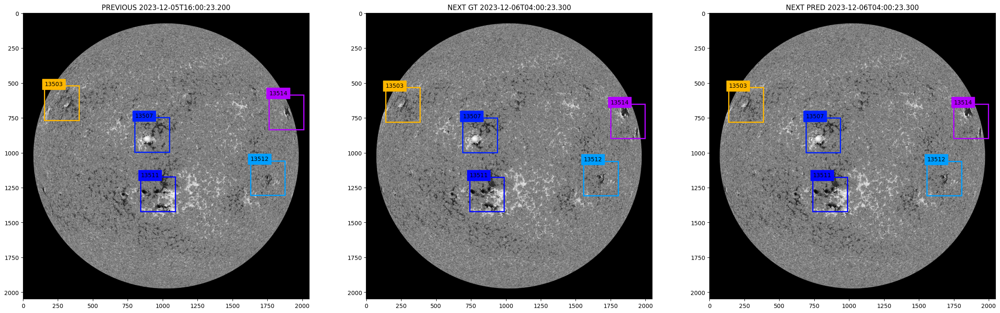
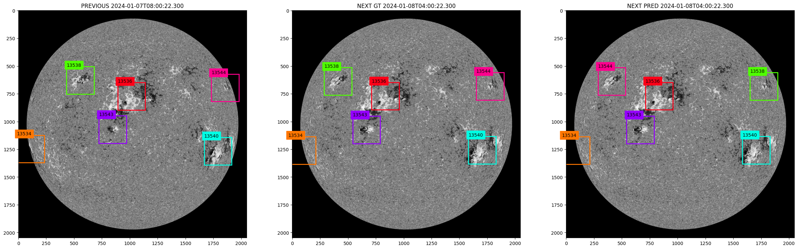
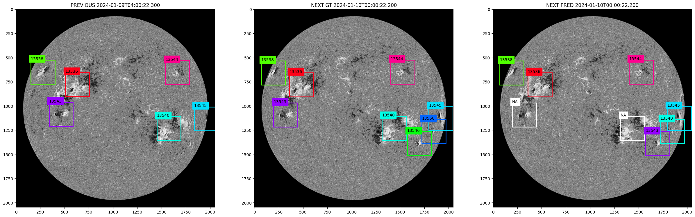

<h1>Re-ID Module</h1>

- Trained a Siamese network with triplet loss
- Dataset
  - Mean width, height of ARs in training set
  - Resized to 256 x 256
  - Sampled such that anchor and positive are not more than 24 frames apart

- Training
  - 100 epochs
  - Adam LR: 0.001
  - Validated on validation set (patches match with mean width, height in training)

- Model
  - MobileNetV1 (lightweight depthwise convs)
  - Feature vector of size 256 (latent dim)

- Hungarian matching results:

