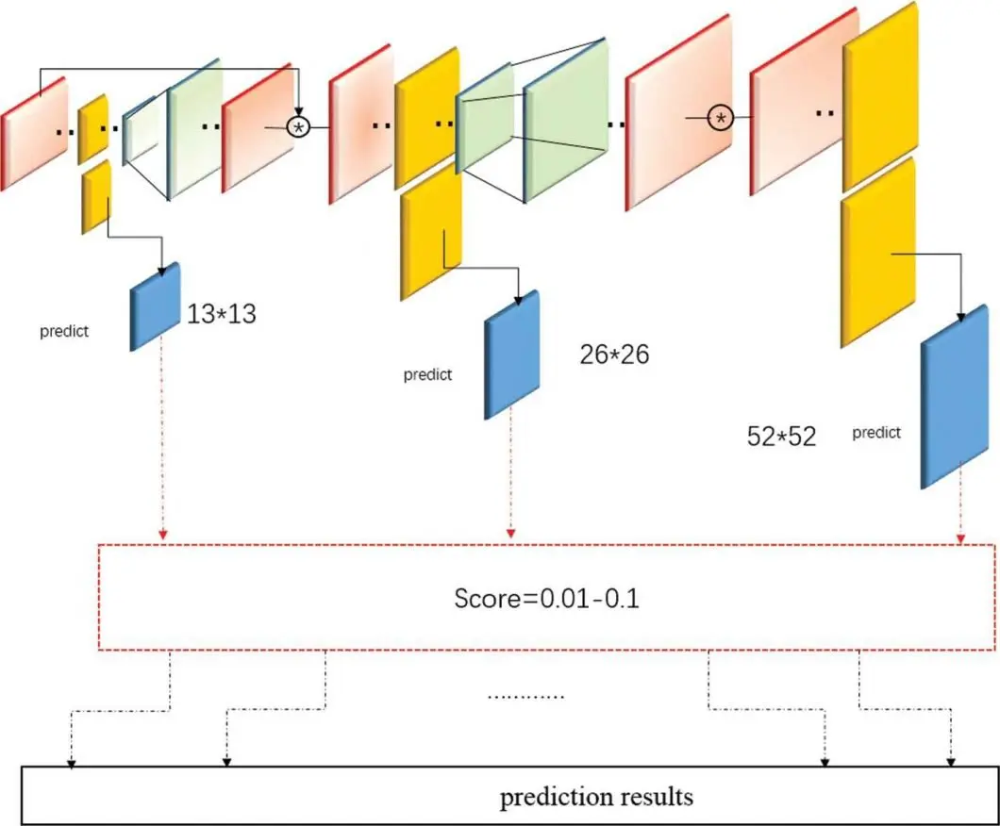

<h1>Detection</h1>

### YOLOv3

### 680 Images
(4096 x 4096) -> (1024 x 1024)

## Results - On training set

### Confidence threshold: .7 - IoU NMS threhshold: .3
<video controls width="600">
  <source src="resources/2/conf_0.7-iou_0.3.mp4" type="video/mp4">
  Your browser does not support the video tag.
</video>

### What's next, tracking (i.e., AR Association) - ByteTrack
Work with ground truth of the 680 images. Detection part mocked.
