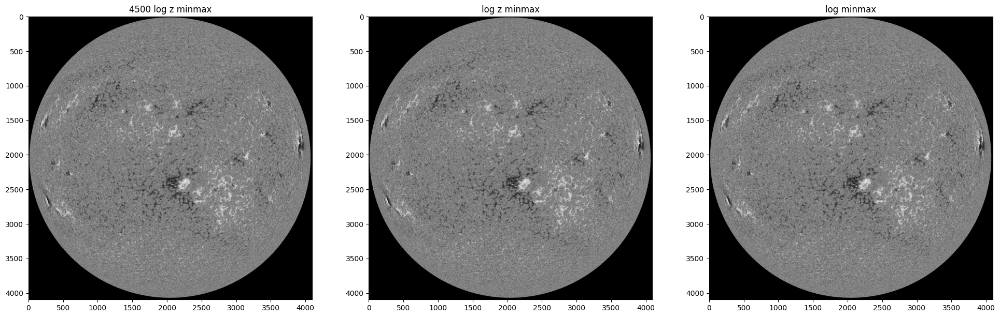
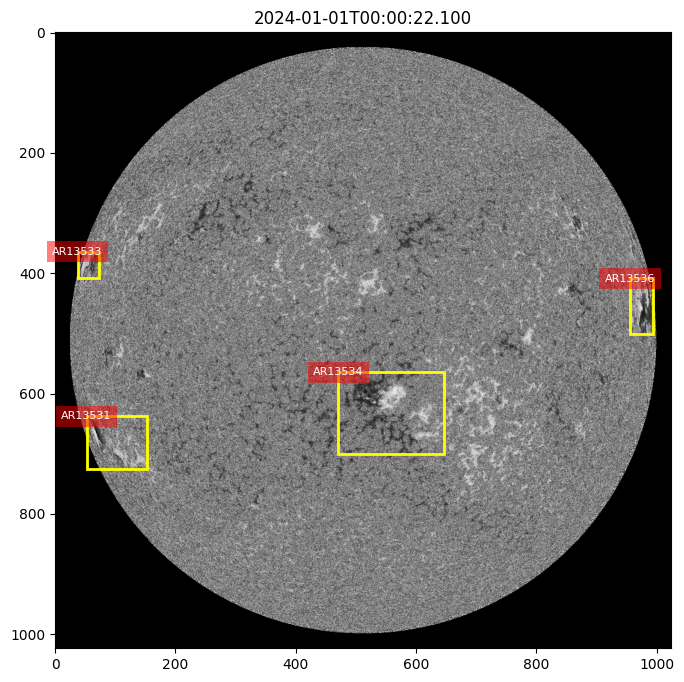

<h1>Dataset</h1>

- Preprocessing differences

- Masking the noisy area

- 4 hour intervals (possible minimum)

- Removing slow ARs (not moving for 5 frames)

- One training experiment
  - 4 epochs
  - Batch size of 8
  - Resized from 4096 to 1024
  - Training data: 2024 - {Sep.}: 1779
  - Test data: 2024 Sep.: 180

<video controls width="600">
  <source src="resources/6/conf_0.1-iou_0.3.mp4" type="video/mp4">
  Your browser does not support the video tag.
</video>

  - More gpu will allow higher resolution
  - More training data will be downloaded