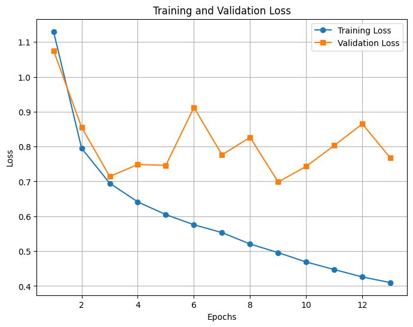

<h1>An experiment</h1>

- Gathered data from 2010 up to Nov. 2024
- 13 epochs
- Batch size of 8
- Resized from 4096 to 1024
- Training data: 2010 to 2024 - {Sep. 2024}: 5275
- Test data: 2024 Sep.: 180
- Detector: YOLOv3
- Tracker: DeepSORT (76x76 descriptor patches)

<video controls width="600">
  <source src="resources/7/deepsort.mp4" type="video/mp4">
  Your browser does not support the video tag.
</video>

<h2>Future plans</h2>

- Implement YOLOv11
- Augment the data
- Design the systematic experiments