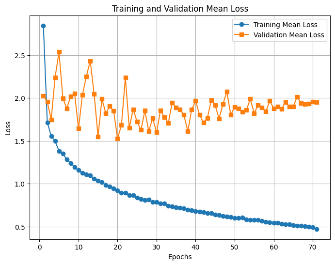

<h1>Another experiment</h1>

<h2>Previous plans</h2>

- Implement YOLOv11 ✅
- Augment the data ✅
- Design the systematic experiments ❌

<h2>Experiment setup</h2>

- YOLOv11
- Random horizontal flip
- +/- 5 deg rotation
- 70 epochs
- Batch size of 8
- Resized from 4096 to 2048
- Multi-GPU utilization (required some configurations)
- Training set: 4602
- Validation set: 180 (Sequence)
- Test set: 2024 Sep.: 180 (Sequence)
- Tracker: BYTETrack

<video controls width="600">
  <source src="resources/8/byte.mp4" type="video/mp4">
  Your browser does not support the video tag.
</video>

Ground truth:

<video controls width="600">
  <source src="resources/8/gt.mp4" type="video/mp4">
  Your browser does not support the video tag.
</video>

<h2>Future plans</h2>

- Tuesday:

  - Change train/val/test distr (less training)
  - Detection metrics: IoU, Precision, Recall, F1
  - Tracking metrics MOTA, IDF1, HOTA, MT, ML

- Friday:

  - Design the systematic experiments
  - Grid search on the validation set (for tracking)
  - report BYTE, SORT, DeepSORT