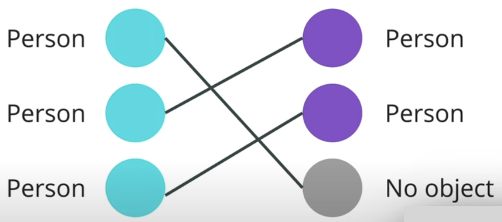
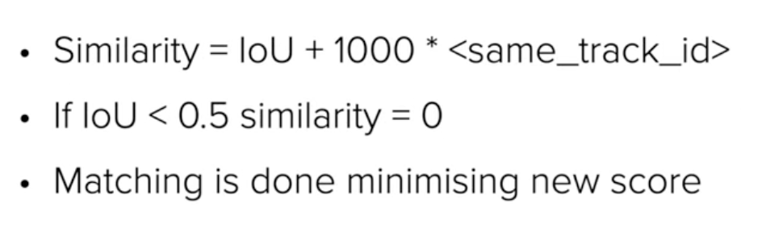
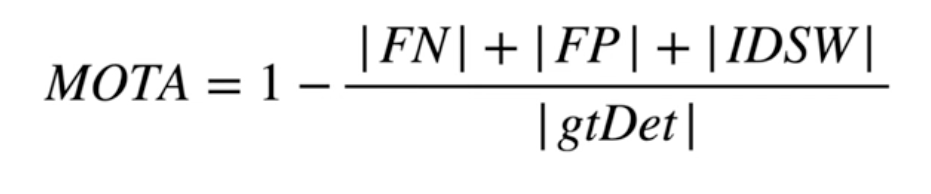
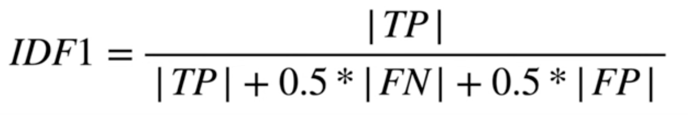
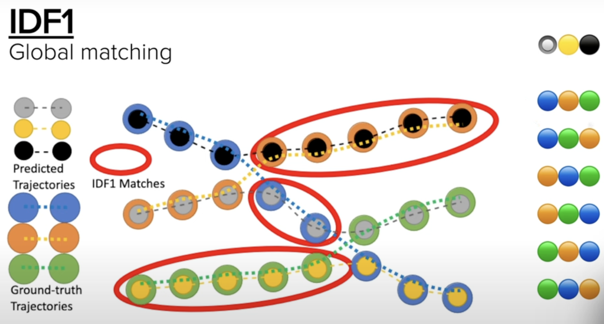
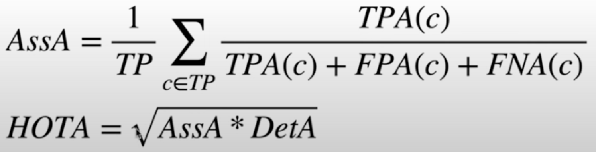
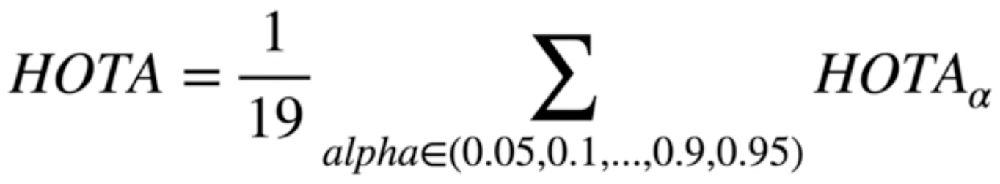
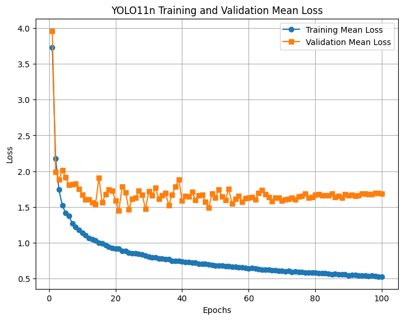
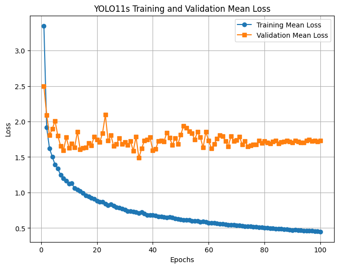

<h2>Evaluation metrics</h2>
Hungarian matching, AKA linear sum assignment:

Detection evaluation metrics:

- <a href="https://cocodataset.org/#detection-eval">COCO metrics</a>
    - **mAP[.50:.95]**
    - mAP.50
    - mAP.75

Tracking evaluation metrics:
- MOTA

Sticky hungarian matching

- IDF1

- MOTP: Precision from MOTA
- HOTA
    - AssA

    - DetA: MOTA without IDSW

<h2>Two experiments</h2>

- Data: 
    - 80% train, 10% val, 10% test
    - +/- 5 degree rotation and 0.5 random horizontal flip
- 100 epochs
- YOLOv11
    - size n and s

YOLO11n loss plot

YOLO11s loss plot

Detection metrics

| Model | mAP50-95 | mAP50 |
|-------|----------|-------|
| n     | 0.41     | 0.643  |
| s     | 0.39     | 0.646  |
| m     |          |       |
| l     |          |       |
| ~~x~~ | ~~0.42~~ | ~~0.68~~ |

BYTETrack results (not trustable yet) - On validation set

YOLO11n

<video controls width="600">
  <source src="resources/9/byte_n.mp4" type="video/mp4">
  Your browser does not support the video tag.
</video>

YOLO11s

<video controls width="600">
  <source src="resources/9/byte_s.mp4" type="video/mp4">
  Your browser does not support the video tag.
</video>